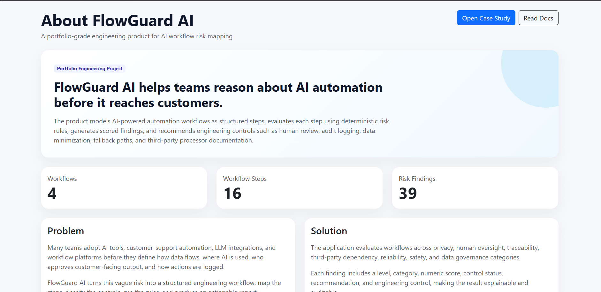
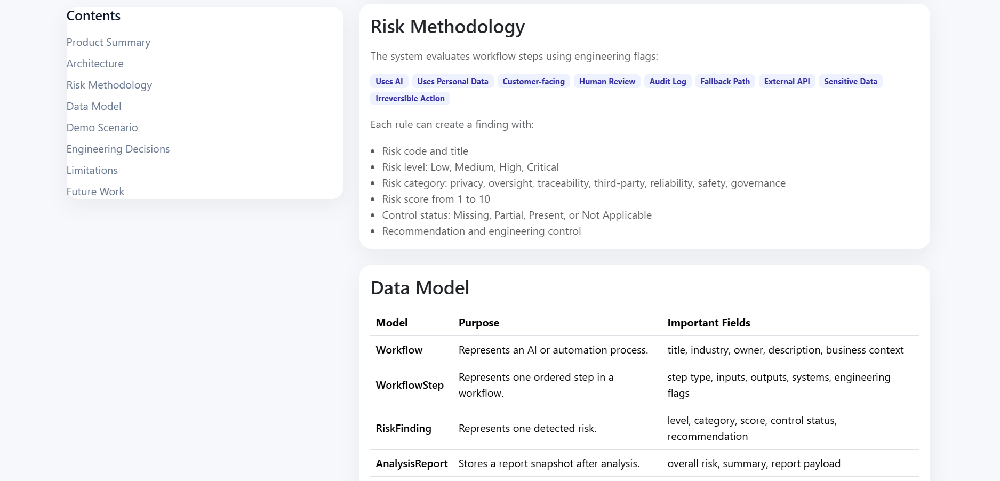
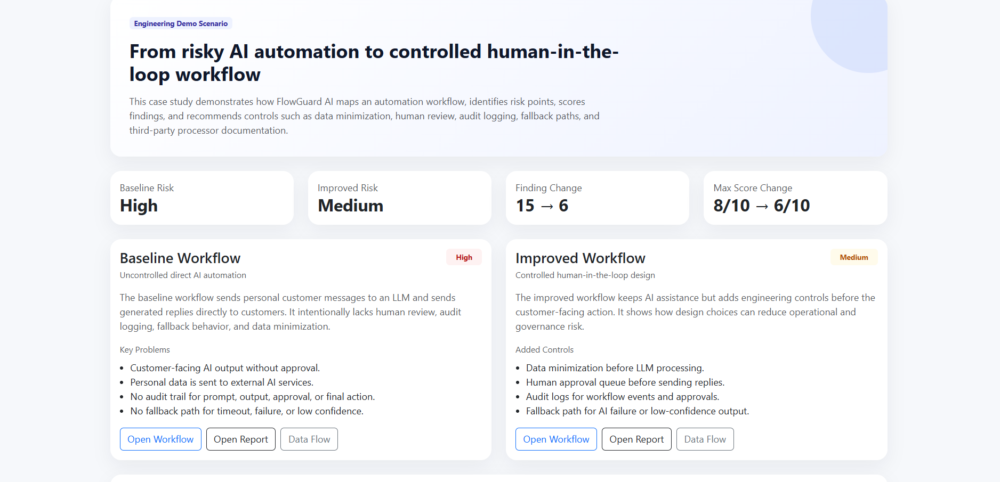
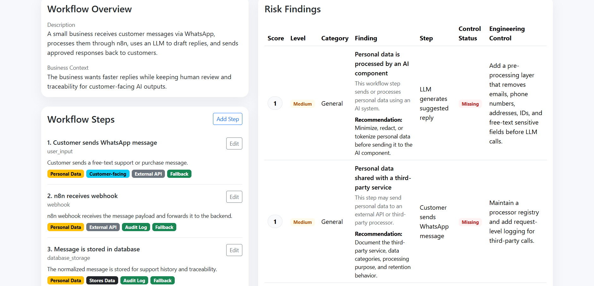
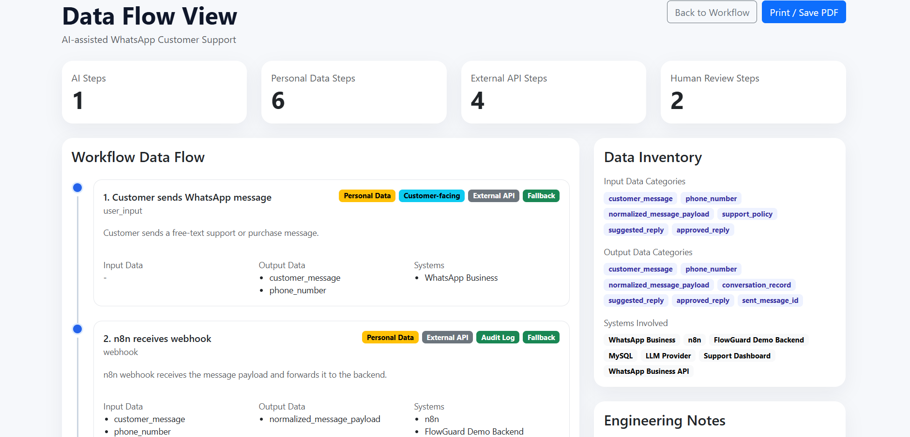

# FlowGuard AI

FlowGuard AI is a Laravel 11 / PHP 8.2 engineering MVP for mapping AI-powered automation workflows, detecting operational and technical risk points, scoring findings, and generating structured reports.

The project is designed as a portfolio-grade backend engineering product. It demonstrates MVC architecture, service-layer design, deterministic domain rules, workflow modeling, risk scoring, audit logging, data-flow reasoning, and report generation.

FlowGuard AI focuses on the backend engineering challenges behind AI-assisted business workflows: traceability, reviewability, risk visibility, and structured reporting.

## Problem

Small businesses and product teams increasingly use AI assistants, LLMs, webhooks, automation tools, and third-party APIs in customer-facing workflows.

However, many workflows are deployed without clearly answering:

* Where does customer data flow?
* Which steps use AI?
* Is personal data sent to an external provider?
* Is AI output reviewed by a human?
* Are prompts, outputs, approvals, and actions logged?
* Is there a fallback path if AI fails?
* Are customer-facing AI interactions controlled?
* Are irreversible automated actions properly reviewed?

FlowGuard AI turns these questions into a structured engineering analysis.

## Solution

The product lets users define a workflow as ordered steps. Each step includes engineering flags such as:

* Uses AI
* Uses personal data
* Uses external API
* Has human review
* Is customer-facing
* Stores data
* Uses sensitive data
* Has audit log
* Has fallback path
* Is irreversible action

The system then applies deterministic risk rules and generates risk findings with:

* Risk level
* Risk category
* Numeric risk score
* Control status
* Description
* Recommendation
* Engineering control

Instead of relying on an unpredictable AI model to judge risk, FlowGuard AI uses explicit domain rules. This makes the analysis explainable, repeatable, and easier to audit.

## Key Features

* Workflow CRUD
* Workflow step CRUD
* Rule-based risk analysis
* Risk scoring from 1 to 10
* Risk categories and control statuses
* Analysis reports
* Data-flow view
* Audit logs
* Portfolio case study
* Demo workflow builder
* Web dashboard
* REST API
* Reusable Blade partials
* Separated CSS and JavaScript
* Feature test coverage for core workflows

## Tech Stack

* PHP 8.2
* Laravel 11
* MySQL
* Blade
* Bootstrap
* Docker
* PHPUnit
* Composer

## Architecture

```text
Browser / User
      |
      v
Blade Views + Bootstrap + Application CSS/JS
      |
      v
Web Controllers / API Controllers
      |
      v
Form Requests + Services
      |
      v
RiskAnalyzer Service
      |
      v
Risk Rule Registry
      |
      v
Domain Risk Rules
      |
      v
Eloquent Models
      |
      v
MySQL Database
```

## Backend Engineering Highlights

* Laravel-based MVC architecture
* REST API for workflows, workflow steps, risk findings, reports, and audit logs
* Service-layer risk analysis using deterministic domain rules
* Form Request validation
* API Resources for response transformation
* Audit logging for workflow creation, updates, deletion, and analysis
* Database migrations, seeders, and demo workflow builder
* Feature tests for workflow APIs, risk analysis, portfolio case study, and audit logs
* Docker-based local development setup
* Structured separation between controllers, services, domain rules, and presentation

## Risk Analysis Design

FlowGuard AI uses deterministic domain rules to identify risk points in AI-assisted workflows.

Examples of detected risks include:

* AI processing personal data
* AI processing sensitive data
* External API data sharing
* Missing human review
* Missing audit trail
* Missing fallback path
* Irreversible automation without review
* Customer-facing AI decision points

Each rule produces a finding with:

* Risk category
* Severity level
* Risk score
* Control status
* Explanation
* Recommendation
* Suggested engineering control

This approach makes the risk analysis transparent and repeatable.

## Compliance-Aware Features

FlowGuard AI is designed as a backend-focused portfolio project for AI workflow risk assessment. It helps document and analyze AI-assisted business workflows by identifying:

* Personal data usage
* Sensitive data exposure
* External API sharing
* Missing human review
* Missing audit trail
* Missing fallback path
* Irreversible automated actions
* Customer-facing AI decisions

The project is not intended to replace legal compliance reviews. It demonstrates backend engineering practices for building traceable and reviewable AI-enabled workflow systems.

## REST API

The project includes REST API endpoints for workflow management and risk analysis.

Base API path:

```text
/api/v1
```

Main API capabilities include:

* Create workflows
* List workflows
* Show workflow details
* Update workflows
* Delete workflows
* Add workflow steps
* Update workflow steps
* Delete workflow steps
* Run workflow risk analysis
* Retrieve risk findings
* Retrieve workflow audit logs

Example API paths:

```text
GET    /api/v1/workflows
POST   /api/v1/workflows
GET    /api/v1/workflows/{workflow}
PUT    /api/v1/workflows/{workflow}
DELETE /api/v1/workflows/{workflow}

POST   /api/v1/workflows/{workflow}/steps
PUT    /api/v1/workflow-steps/{workflowStep}
DELETE /api/v1/workflow-steps/{workflowStep}

POST   /api/v1/workflows/{workflow}/analyze
GET    /api/v1/workflows/{workflow}/findings
GET    /api/v1/workflows/{workflow}/audit-logs
```

## Quick Start with Docker

FlowGuard AI can be started locally using Docker and MySQL.

```bash
cp .env.example .env
docker compose up --build
```

The application will be available at:

```text
http://localhost:8000
```

The API is available under:

```text
http://localhost:8000/api/v1
```

Run database migrations:

```bash
docker compose exec app php artisan migrate
```

Run the test suite:

```bash
docker compose exec app php artisan test
```

## Local Development without Docker

Install PHP dependencies:

```bash
composer install
```

Create the environment file:

```bash
cp .env.example .env
```

Generate the application key:

```bash
php artisan key:generate
```

Run migrations:

```bash
php artisan migrate
```

Start the local development server:

```bash
php artisan serve
```

Run tests:

```bash
php artisan test
```

## Test Status

The project test suite currently covers core backend behavior including workflow APIs, risk analysis, audit logs, and the portfolio case study.

Current test result:

```text
Tests: 10 passed, 35 assertions
```

## Screenshots

### About / Product Overview



### Risk Methodology and Data Model



### Portfolio Case Study



### Workflow Risk Findings



### Data Flow View



## Project Status

FlowGuard AI is a backend engineering MVP built for portfolio and technical demonstration purposes.

Completed:

* Laravel 11 upgrade
* PHP 8.2 support
* Workflow CRUD
* Workflow step CRUD
* Rule-based risk analysis
* Audit logging
* Reports
* Data-flow view
* Portfolio case study
* Docker setup
* Feature tests

Potential future improvements:

* Authentication and role-based access control
* OpenAPI documentation
* Postman collection
* More advanced filtering and search
* Additional risk rules
* CI pipeline with GitHub Actions
* Expanded test coverage
* Deployment demo

## Disclaimer

FlowGuard AI is not a legal compliance tool and does not provide legal advice. It is a backend engineering MVP designed to demonstrate how AI-assisted workflows can be modeled, analyzed, logged, and reviewed from an engineering perspective.
